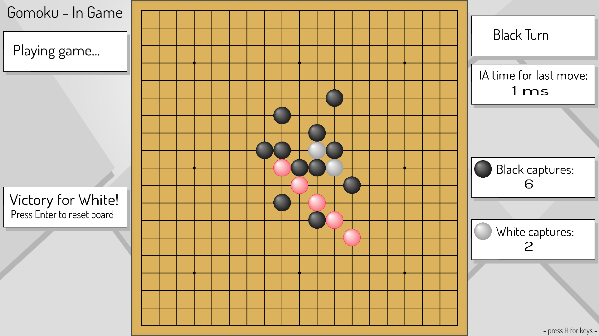
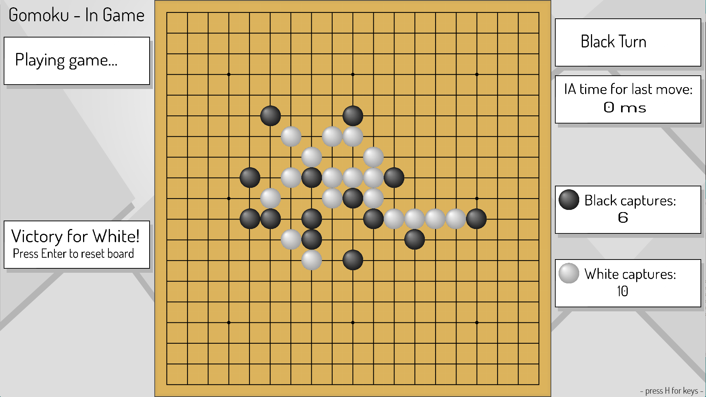

| Language | Field           | project | grade |
| :------: |:---------------:| :------:|:-----:|
| C++      | Algorithms & AI | Duo     |113/125|

# Gomoku
[Gomoku](https://en.wikipedia.org/wiki/Gomoku) is a strategy board game similar to [Go](https://en.wikipedia.org/wiki/Go_(game)) game.
The winner is the first player to form an unbroken chain of five stones (horizontally, vertically, or diagonally) or the first to capture 10 enemy's stones.

## Introduction
Playable in 1vs1 or against an AI. This program provides a graphical interface in [SDL2](https://www.libsdl.org/) framework. The challenge of this project is to develop an optimized AI and heuristic in order to respect the computation time constraints.

## AI
The core of this project is __Artificial Intelligence__ using a [Min-Max](https://en.wikipedia.org/wiki/Minimax) algorithm with [Alpha-Beta](https://en.wikipedia.org/wiki/Alpha%E2%80%93beta_pruning) pruning.  
the AI analyses the board, and "search" for the most interesting move to make, thanks to our game heuristic.

## Demo
Video:  

Screenshots:  

By [scaussin](https://github.com/scaussin) and [aleung-c](https://github.com/aleung-c)
